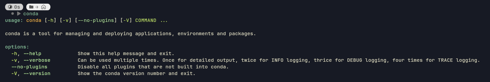

# Praktikum 1
## Instalasi Anaconda di Sistem dan VSCode

Terintegrasi dengan Terminal

Terintegrasi dengan VSCode (+Jupyter)

## Install Library PYPREP, Scipy, wandb, dan PYECG
Bukti semua terinstal (tidak ada error)

### Fungsi tiap Library
- wandb: Weights and Biases, digunakan di pemodelan ML untuk mencatat metrik pelatihan, melacak eksperimen, menyimpan checkpoint model, dan bisa visualisasi performa evaluasi 
- scipy: Melakukan komputasi ilmiah, teknik, serta perhitungan matematika tingkat lanjut
- pyprep: Melakukan preprocessing data EEG (elektroensefalografi/rekaman aktivitas listrik otak)
- pyecg: Membaca, menulis, menyaring, dan menganalisis data sinyal Elektrokardiogram (EKG/ECG/aktivitas listrik jantung)

## Soal

### 1. Contoh tindakan melanggar etika dan hukum tentang penggunaan kecerdasan buatan
Ada kasus di pengadilan [Mata v. Avianca](https://law.justia.com/cases/federal/district-courts/new-york/nysdce/1:2022cv01461/575368/54/) dimana pengacara menyerahkan laporan singkat yang berisi
kutipan palsu dan kutipan kasus ke pengadilan New
York. Ringkasan tersebut diteliti menggunakan ChatGPT.

Para pengacara tidak menyadari bahwa ChatGPT
dapat berhalusinasi, gagal memverifikasi bahwa kasus
tersebut benar-benar ada. Setelah kesalahannya terungkap, pengadilan membatalkan kasus kliennya dan memberikan sanksi
kepada para pengacara.

### 2. Contoh dampak energi dan lingkungan terhadap pemanfaatan kecerdasan buatan dan bagaimana cara mengatasinya

Emisi karbon semakin mengingkat akibat penggunakan bahan bakar fosil yang masih digunakan oleh kebanyakan data center, misal [data Google ini](https://storage.googleapis.com/gweb-mobius-cdn/sustainability/uploads/7f477eb723fe0c23d03f94b90a08882b9f28187d.pdf) pada tahun 2026. Dampak emisi karbon yang semakin banyak adalah global warming, cuaca ekstrim, dan bisa sampai kepunahan spesies hewan dan tumbuhan. Cara mengatasinya adalah mengimplementasi data center dengan menggunakan energi yang lebih eco-friendly, seperti solar, angin, atau nuklir.